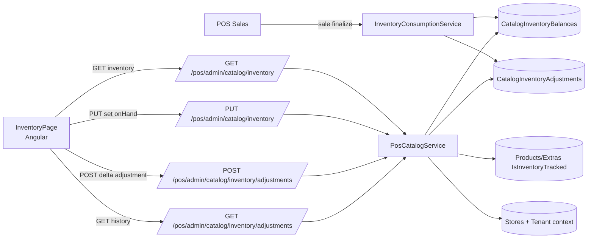
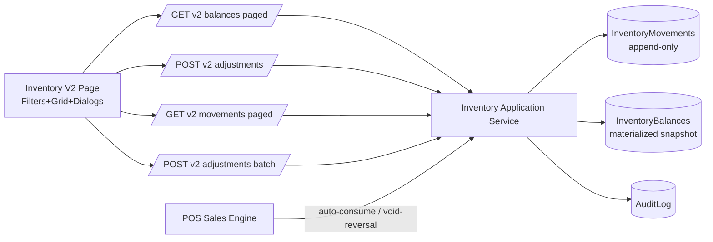

# Inventarios POS — Auditoría de estado actual y propuesta v2

## 1) Estado actual (Front)

### Mapa de componentes y rutas
- `InventoryPage` existe como pantalla standalone en dos rutas:
  - Ruta directa: `/app/admin/pos/inventory` (lazy-load del componente).
  - Ruta dentro del catálogo: `/app/admin/pos/catalog/inventory`.
- Ambas rutas están protegidas por `roleGuard` para `AdminStore`, `Manager`, `TenantAdmin`, `SuperAdmin`.
- También hay navegación desde el menú Admin → POS Catálogo → Inventory.

### Flujo actual de UI (InventoryPage)
- Pantalla “Inventory Lite” con tres bloques:
  1. **Stock actual** (tabla editable por fila, botón Guardar por item).
  2. **Nuevo ajuste** (form con storeId, tipo, item, delta, reason, note).
  3. **Historial de movimientos** (tabla + filtros por store/itemType/itemId/reason/rango fecha).
- Carga inicial en constructor: `loadCatalogItems()`, `loadInventory()`, `loadHistory()`.
- Se usan `signals` + `computed` para estado local y `FormControl` para formularios.
- UX actual es funcional pero de bajo nivel (“Lite”): inputs de `storeId` e `itemId` en texto plano, sin catálogo contextual de sucursales, sin paginación, sin tabla virtual.

### Servicios/modelos/adapters involucrados
- `PosInventoryAdminApiService`:
  - Catálogo inventario nuevo (`/v1/pos/admin/catalog/inventory`) para list/upsert de balance por `Product|Extra`.
  - Endpoints legacy (`/v1/pos/admin/inventory`) para inventario histórico por producto (`StoreInventory`).
- `PosInventoryAdjustmentsApiService`:
  - Crea ajuste (`POST /v1/pos/admin/catalog/inventory/adjustments`).
  - Lista historial (`GET .../adjustments`).
- `PosCatalogApiService`: se usa para cargar productos/extras y poblar selector de item.
- Modelo fuerte en `pos-catalog.models.ts` (DTOs de balance/ajustes + razones).

### Patrones front observados
- Estado con signals (bien alineado con Angular moderno).
- Rendering con `@if`/`@for` (control-flow nativo).
- Permisos por route guard + menú por roles.
- i18n: no hay capa de internacionalización formal; strings hardcoded en español/inglés mezclados.
- Notificaciones: mensajes inline en la página (no toast global).
- Performance actual:
  - Sin server-side pagination.
  - Sin virtual scroll.
  - Sin debounce en filtros.
  - Sin cache dedicada para inventario/ajustes.

## 2) Estado actual (Back)

### Entidades/tablas involucradas
- Modelo principal v1 actual:
  - `CatalogInventoryBalance` (snapshot de on-hand por `StoreId + ItemType + ItemId`).
  - `CatalogInventoryAdjustment` (movimientos/ajustes históricos).
- Modelo legacy coexistente:
  - `StoreInventory` (solo producto, con `OnHand`, `Reserved`, `RowVersion`).
- Flags relevantes:
  - `Product.IsInventoryTracked`
  - `Extra.IsInventoryTracked`
  - `PosSettings.ShowOnlyInStock`

### Endpoints / controllers inventario
- `PosAdminCatalogController`:
  - `GET/PUT /pos/admin/inventory` (legacy)
  - `PUT /pos/admin/inventory/settings`
  - `GET/PUT /pos/admin/catalog/inventory` (balance catálogo)
  - `POST/GET /pos/admin/catalog/inventory/adjustments`
- `PosReportsController`:
  - `GET /pos/reports/inventory/current`
  - `GET /pos/reports/inventory/low-stock`
  - `GET /pos/reports/inventory/out-of-stock`

### Reglas actuales y cálculo de stock
- Para catálogo inventariable (v1 de admin POS), el stock operativo sale del snapshot persistido en `CatalogInventoryBalances`.
- Ajustes manuales:
  - `CreateCatalogInventoryAdjustmentAsync` aplica delta sobre balance existente y guarda un movimiento en `CatalogInventoryAdjustments`.
- Set directo (upsert):
  - `UpsertCatalogInventoryAsync` fija `OnHandQty` absoluto y registra un ajuste con delta derivado.
- Consumo automático por venta:
  - `InventoryConsumptionService.ConsumeForSaleAsync` descuenta balance y crea ajustes `SaleConsumption`.
- Reversa por cancelación/void:
  - `ReverseForVoidAsync` crea movimientos `VoidReversal` y suma de vuelta.

### Reglas de negocio implementadas hoy
- **Stock negativo no permitido** en ajustes/upsert de catálogo (`409 NegativeStockNotAllowed`).
- **Item no trackeado**: ajustes rechazan con `InventoryNotTracked`.
- **OptionItem** no es inventariable (validación explícita).
- **Idempotencia parcial**:
  - Ajuste manual soporta `ClientOperationId` y retorna movimiento existente si se repite.
  - Consumo por venta evita duplicar por conteo esperado o índice único por referencia.
- **Concurrencia**:
  - Hay `RowVersion` en `StoreInventory` legacy, pero no se usa de forma explícita en endpoints v1 catálogo.
  - En `CatalogInventoryBalance` no hay token de concurrencia optimista; depende de transacción SaveChanges + restricciones.

### Multi-tenant / store isolation
- Aislamiento por `TenantId` + `StoreId` en queries de inventario.
- Validación obligatoria de pertenencia de `Store` al tenant (`EnsureStoreBelongsToTenantAsync`).
- `TenantContextService` permite override (`X-Tenant-Id`) solo para `SuperAdmin`; otros roles no.

### Auditoría
- Se registran entradas de auditoría para ajustes/set/consumo/reversa vía `IAuditLogger`.
- `CatalogInventoryAdjustment` guarda `CreatedAtUtc`, `CreatedByUserId`, razón, referencia, nota, tipo de referencia.

### Performance y DB
- Índices relevantes:
  - Unique balance: `(StoreId, ItemType, ItemId)`.
  - Ajustes: índices por store/item, store/fecha, referencia, clientOperationId.
  - Unique de movimiento por referencia `(ReferenceType, ReferenceId, ItemType, ItemId, Reason)`.
- Lecturas de inventario/reportes actualmente devuelven listas completas (sin paginación server-side).

## 3) Diagrama actual (Mermaid)

## 4) Problemas detectados (UX + técnicos) con evidencia

1. **Doble modelo de inventario (legacy + catálogo) aumenta complejidad y riesgo funcional**.
2. **InventoryPage con experiencia operativa limitada para POS real**:
   - captura IDs manuales,
   - sin acciones bulk,
   - sin paginación/virtualización,
   - sin filtros ricos por categoría/SKU/tracking.
3. **Inconsistencia de precisión numérica**:
   - backend usa `decimal(18,3)` pero front parsea con `parseInt` al guardar fila.
4. **Concurrencia optimista incompleta en modelo principal (`CatalogInventoryBalance`)**.
5. **Idempotencia no homogénea**:
   - ajustes la tienen por `ClientOperationId`,
   - set directo no expone estrategia equivalente,
   - ventas dependen de referencia y conteo.
6. **Reportes inventario sin paginación ni límites** (riesgo de crecimiento por tienda grande).
7. **Historial no modelado como Kardex formal en API** (no hay endpoint dedicado con paginación/saldo acumulado por movimiento y filtros orientados a operación diaria).
8. **UX/i18n mixto** (etiquetas en inglés/español, reason codes técnicos visibles).

## 5) Propuesta v2 (UX + reglas de negocio)

### Especificación funcional v2 (MVP)
1. **Vista de existencias** por producto/extra (y preparada para variantes/unidades futuras).
2. **Búsqueda/filtros**: categoría, SKU, nombre, activos, tracked-only, out-of-stock, low-stock configurable.
3. **Ajuste de inventario** con motivo obligatorio, nota opcional, preview de antes/después.
4. **Movimientos/Kardex** por item con filtros por fecha/motivo/referencia/usuario.
5. **Entradas/salidas operativas** (recepción, merma, traspaso) como presets de ajuste.
6. **Import/export** opcional y separado del catálogo base (iteración posterior).

### Reglas de negocio propuestas (Decision log)
- `D-01`: Mantener bloqueo de stock negativo por default. Permitir habilitarlo solo con feature flag + política tenant.
- `D-02`: Si `IsInventoryTracked=false`, no bloquear venta por stock ni permitir ajustes de inventario (solo toggle de tracking).
- `D-03`: Unidades: mantener `decimal(18,3)` como base; introducir `UnitOfMeasure` por item en iteración.
- `D-04`: Multi-ubicación: almacenar `LocationId` (warehouse/bin) opcional; MVP arranca con store-level.
- `D-05`: Concurrencia: usar optimistic concurrency token en balance + `If-Match`/version en updates críticos.
- `D-06`: Auditoría obligatoria para todo movimiento (`who/when/reason/reference/clientOperationId`).

### Wireframe textual objetivo (InventoryPage)
- **Header**: búsqueda global + selector sucursal + filtros rápidos (tracked, bajo stock, sin stock, categoría).
- **Grid principal** (server-side paginado):
  - columnas: SKU, Nombre, Tipo, Categoría, Tracked, OnHand, Reserved (si aplica), Disponible, Último movimiento, Último usuario.
  - acciones por fila: Ajustar, Ver Kardex, Registrar entrada/salida.
  - acción bulk: Ajuste múltiple (CSV o selección múltiple).
- **Estados UX**:
  - loading skeleton,
  - empty state con CTA,
  - error state con retry.

### Diseño de Ajuste (modal/drawer)
- Campos: item, sucursal, delta (o set), motivo, referencia, nota.
- Validaciones: delta ≠ 0, motivo obligatorio, no negativo (si política activa).
- Preview: `QtyBefore`, `Delta`, `QtyAfter`.
- Confirmación explícita (doble validación para decrementos grandes).

### Métricas de éxito
- T1: Ajustar 20 productos en < 3 min (sin import).
- T2: Tiempo de carga de grid inventario p95 < 800ms (página inicial).
- T3: Crear ajuste individual en ≤ 6 clics.
- T4: Tasa de errores de concurrencia recuperables < 1%.

### Riesgos y mitigación
- Riesgo de migración por coexistencia de modelos: encapsular en servicio anti-corruption y deprecación gradual.
- Riesgo de regresión en ventas: mantener cobertura de pruebas integración de consumo/reversa antes de cambios.
- Riesgo de carga en DB: paginación server-side + índices y límites en reportes.

## 6) Propuesta v2 (arquitectura back/front)

### Backend objetivo
- **Patrón recomendado**: `movements-first + snapshot persistido`.
  - `InventoryMovements` como ledger inmutable.
  - `InventoryBalances` como proyección materializada por `(TenantId, StoreId, ItemType, ItemId, [LocationId])`.
- **Contratos DTO sugeridos**:
  - `InventoryBalanceRowDto` (grid).
  - `InventoryMovementRowDto` (kardex paginado).
  - `CreateInventoryAdjustmentCommand` (delta/set + metadata).
  - `BulkInventoryAdjustmentCommand`.
- **Endpoints v2 sugeridos**:
  - `GET /v2/pos/inventory/balances?storeId=&q=&categoryId=&tracked=&page=&pageSize=`
  - `POST /v2/pos/inventory/adjustments`
  - `POST /v2/pos/inventory/adjustments/batch`
  - `GET /v2/pos/inventory/movements?storeId=&itemId=&from=&to=&reason=&page=&pageSize=`
- **Concurrencia/idempotencia**:
  - `clientOperationId` obligatorio para comandos write.
  - `version`/etag de balance para set explícito.
  - transacción por comando write + índice único de idempotencia.

### Frontend objetivo
- `InventoryFacadeService` para orquestar estado de filtros/paginación/cache.
- Componentes:
  - `InventoryFiltersComponent`
  - `InventoryGridComponent`
  - `InventoryAdjustmentDialogComponent`
  - `InventoryMovementsDrawerComponent`
- Estado/cache:
  - cache por query key (store + filtros + page).
  - invalidación dirigida tras ajuste exitoso.
- Error/loading:
  - patrón uniforme de `load-state` (idle/loading/success/error).
  - mensajes de error user-friendly mapeando reason codes backend.

### Migración incremental (sin big bang)
- Mantener endpoints v1 y agregar v2 en paralelo.
- InventoryPage migra por feature flag (`inventory.v2.enabled`).
- Deprecar legacy endpoints al cerrar adopción (telemetría + warning headers).

## 7) Diagrama v2 (Mermaid)

## 8) Plan por PRs con casos y pruebas

### PR1 — Lectura (grid + filtros + paginación)
- Cambios:
  - endpoint paginado balances + filtros,
  - adaptación InventoryPage a grid server-side.
- Archivos impactados (estimado):
  - controller report/admin inventory,
  - service query de balances,
  - `inventory.page.ts` + servicio api.
- Pruebas requeridas:
  - API integration: filtros + paginación + tenant isolation.
  - Front unit: query params, render paginado, debounce.
- Riesgos:
  - performance de query por joins itemName/SKU.
- Validación manual:
  - filtrar por SKU/categoría/tracked y navegar páginas.

### PR2 — Ajuste inventario (command + UI)
- Cambios:
  - comando ajuste v2 (idempotencia obligatoria),
  - modal con preview y validaciones.
- Pruebas:
  - conflictos de concurrencia,
  - idempotencia por reintento,
  - no-negativo.
- Riesgos:
  - doble escritura accidental en reintentos sin clientOperationId.
- Validación manual:
  - aplicar ajuste, recargar, verificar historial y balance.

### PR3 — Historial/Kardex por producto
- Cambios:
  - endpoint movimientos paginado,
  - drawer de kardex en front.
- Pruebas:
  - orden temporal, filtros por rango y motivo,
  - referencias de venta/void.
- Riesgos:
  - volumen alto en tablas de movimientos.
- Validación manual:
  - navegar movimientos históricos y verificar saldos.

### PR4 — Performance + índices DB
- Cambios:
  - optimización de queries,
  - índices adicionales según planes reales,
  - límites/guardrails de pageSize.
- Pruebas:
  - benchmarks de consulta,
  - smoke de endpoints críticos.
- Riesgos:
  - migraciones pesadas en producción futura.
- Validación manual:
  - comparar latencia p95 antes/después.

### PR5 — Extras (import/export, batch, multi-location)
- Cambios:
  - import/export inventario,
  - batch adjustments,
  - modelo de ubicación opcional.
- Pruebas:
  - validación de archivos,
  - idempotencia batch parcial,
  - seguridad por tenant/store/location.
- Riesgos:
  - complejidad operativa y de soporte.
- Validación manual:
  - carga masiva + auditoría y rollback controlado.

## 9) Preguntas abiertas (imprescindibles)
1. ¿Habrá inventario por variantes (talla/sabor) en corto plazo o solo producto/extra?
2. ¿Se requiere multi-almacén en MVP o se limita a sucursal?
3. ¿Negativo permitido en algún vertical (restaurante rápido vs retail)?
4. ¿Necesitan importación inicial CSV en MVP o puede esperar a PR5?
